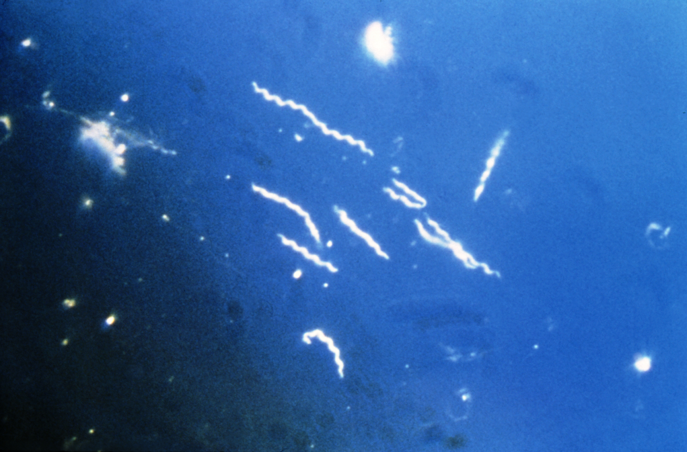

Import the Sequences.csv file.
```{r}
Dat <- read.csv("./Sequences.csv") # Imports dataset 
```

Count the number of each base pair (A, T, C and G), in each of the three sequences. (Hint: do not include any characters from the header, use the nucleotide sequence only; you MIGHT use gsub(), nchar(), for loops, if/then statements)
```{r}

Dat <- subset(Dat,select=c(Name, Sequence)) # Removes 'X' column from .csv file

install.packages("stringr") # Installs Stringr package in R
library(stringr) # Loads Stringr package in R

Seq1 <- Dat[1,2] # Isolates sequence 1 from [row 1, column 2]

str_count(Seq1, "A") #154 - Counts the number of A nucleotides found in Seq 1
str_count(Seq1,"T") #114 - Counts the number of T nucleotides found in Seq 1
str_count(Seq1,"C") #82 - Counts the number of C nucleotides found in Seq 1
str_count(Seq1,"G") #131 - Counts the number of G nucleotides found in Seq 1

Seq2 <- Dat[2,2] # Isolates sequence 2 from [row 2, column 2]

str_count(Seq2, "A") #155 
str_count(Seq2,"T") #114
str_count(Seq2,"C") #81
str_count(Seq2,"G") #131


Seq3 <- Dat[3,2] # Isolates sequence 3 from [row 3, column 2]

str_count(Seq3, "A") #154
str_count(Seq3,"T") #115
str_count(Seq3,"C") #81
str_count(Seq3,"G") # 131

```

Print out each sequence.
```{r}
Seq1 <- Dat[1,2] # Prints out the first sequence
Seq2 <- Dat[2,2] # Prints out the second sequence
Seq3 <- Dat[3,2] # Prints out the third sequence
```

Print out the number of each nucleotide as a table for each of the three sequences.
```{r}
Nucleotides <- matrix(c(154,114,82,131,155,114,81,131,154,115,81,131),ncol=4,byrow=TRUE) # Organizes the number of each nucleotide for each sequence into a matrix. 
colnames(Nucleotides) <- c("A","T","C","G") # Labels the column names
rownames(Nucleotides) <- c("Seq1","Seq2", "Seq") # Labels the row names 
Nucleotides <- as.table(Nucleotides) # Converts the information above into table format 
print(Nucleotides) # Prints output of table 
```


Include an image of a bacteria from the internet, and a link to the Wikipedia page about Borrelia burgdorferi



https://en.wikipedia.org/wiki/Borrelia_burgdorferi
# Link to Borrelia burgdorferi Wikipedia page


Calculate GC Content (% of nucleotides that are G or C) and create a final table showing GC content for each sequence ID. 
```{r}
(GCSeq1 <- ((82+131)/(82+131+114+154))*100) # 44.28274% - Calculates GC content of sequence HQ433692.1
(GCSeq2 <- ((81+131)/(82+131+114+154))*100) # 44.07484% - Calculates GC content of sequence HQ433694.1
(GCSeq3 <- ((81+131)/(82+131+114+154))*100) # 44.07484% - Calculates GC content of sequence HQ433691.1

GCcontent <- matrix(c(44.3,44.1,44.1),ncol=1,byrow=TRUE) # Organizes GC contents for each sequence intoa  matrix
colnames(GCcontent) <- c("GC Content (%)") # Names the column
rownames(GCcontent) <- c("HQ433692.1","HQ433694.1","HQ433691.1") # Names the rows

GCcontent <- as.table(GCcontent) # Converts the information above into a table format
print(GCcontent) # Prints final table 
```

